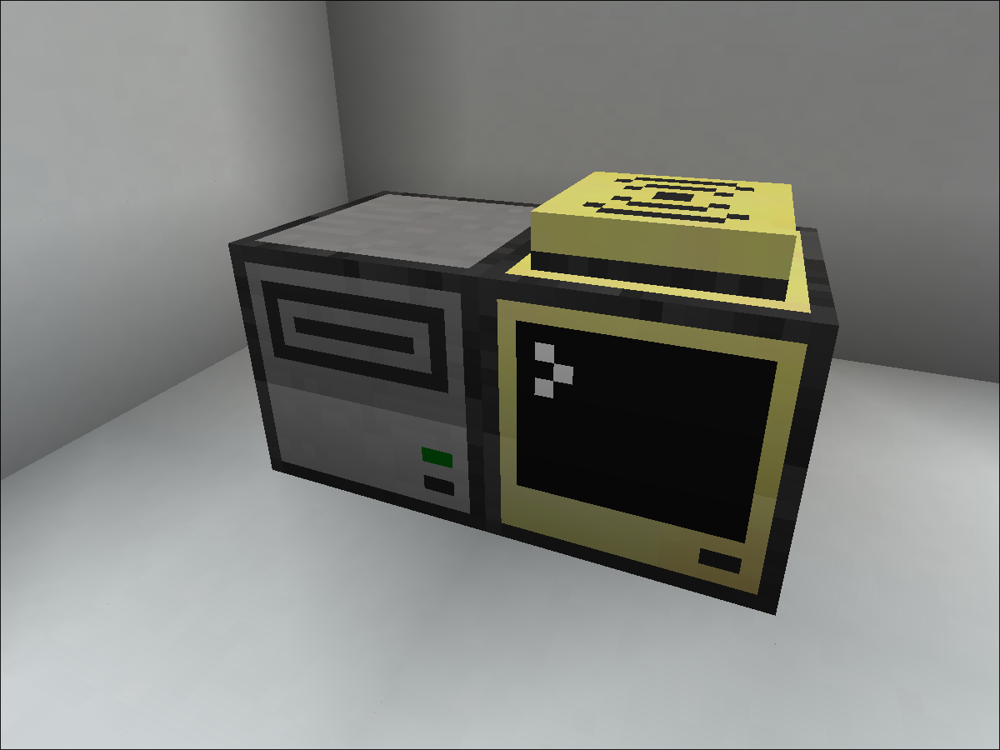

# cc-cryptocoin
A modem-based, decentralized cryptocurrency in minecraft using CC: Tweaked. NOT a blockchain!

## Setup

### Node
A node should only have one **ender** modem and only one disk drive on either the left or right side.  

**Example:**


The floppy disk inside the disk drive will be used as the wallet.
> [!NOTE]
> Do not share the contents of the file inside the floppy disk (or the disk itself) unless you want your money stolen.  

---

### Script
The simplest way to get the script is to run the following command in the advanced computer:
```sh
wget https://raw.githubusercontent.com/mrMalinka/cc-cryptocoin/refs/heads/main/startup.lua
```
Then, run `startup.lua` (or reboot, since its a startup file) and wait for it to connect. You can also run `startup.lua wallet` to get your public wallet address and put it on pastebin. It is recommended to force load the node using any chunk loading method you have.

> [!TIP]
> If you are the first on a server to set up a node, run `startup.lua genesis` instead. This will, by default, start you with 20,000 coins.

---

## Sharing addresses
Since CC has no clipboard features, you can either use the built-in pastebin feature to share an address, or use an [image-to-text](https://www.imagetotext.info/) converter and correct the errors. You can also, of course, type it out directly.

## How it works
A transaction history is stored on all computers in a ledger. The computers occasionally transmit this ledger using the modem, so that new nodes may copy it for themselves. New nodes decide which ledger to pick based on its popularity (how many nodes sent said ledger), however, if a ledger is voted on by nodes that are very close together, the weight of their vote is reduced. Transactions are verified using ed25519 signing, and public wallet addresses are base58 encodings of the ed25519 public key. Balances are not stored anywhere, instead computed using the transaction history.